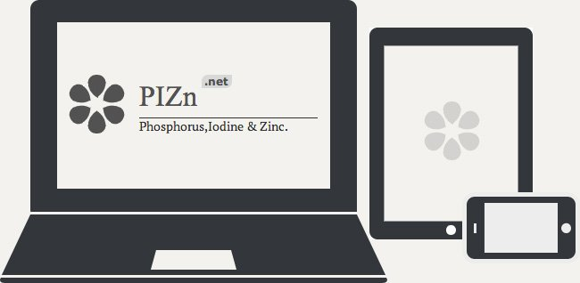
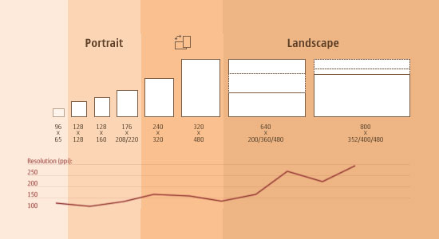
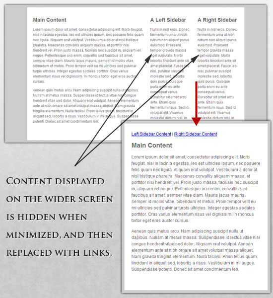

<!-- TOC -->

- [响应式布局概念](#响应式布局概念)
- [响应式设计的步骤](#响应式设计的步骤)
    - [1. 设置 Meta 标签](#1-设置-meta-标签)
    - [2. 通过媒介查询来设置样式 Media Queries](#2-通过媒介查询来设置样式-media-queries)
    - [3. 设置多种试图宽度](#3-设置多种试图宽度)
- [一些注意的](#一些注意的)
    - [1. 宽度需要使用百分比](#1-宽度需要使用百分比)
    - [2. 处理图片缩放的方法](#2-处理图片缩放的方法)
    - [3. 其他属性](#3-其他属性)
- [更多资源](#更多资源)
- [Media Queries](#media-queries)

<!-- /TOC -->

响应式布局等于流动网格布局，而自适应布局等于使用固定分割点来进行布局。

自适应布局给了你更多设计的空间，因为你只用考虑几种不同的状态。而在响应式布局中你却得考虑上百种不同的状态。虽然绝大部分状态差异较小，但仍然也算做差异。它使得把握设计最终效果变得更难，同样让响应式布局更加的难以测试和预测。但同时说难，这也算是响应式布局美的所在。在考虑到表层级别不确定因素的过程中，你也会因此更好的掌握一些基础知识。当然，要做到精确到像素级别的去预测设943*684像素视区里的样子是很难的，但是你至少可以很轻松的确定它是能够正常工作的，因为页面的基本特性和布局结构都是根据语义结构来部署的。

## 响应式布局概念

Responsive design，意在实现不同屏幕分辨率的终端上浏览网页的不同展示方式。通过响应式设计能使网站在手机和平板电脑上有更好的浏览阅读体验。

经过不停地学习和实践，如今总结响应式设计的方法和注意点。其实很简单。

## 响应式设计的步骤

### 1. 设置 Meta 标签

大多数移动浏览器将HTML页面放大为宽的视图（viewport）以符合屏幕分辨率。你可以使用视图的meta标签来进行重置。下面的视图标签告诉浏览器，使用设备的宽度作为视图宽度并禁止初始的缩放。在&lt;head&gt;标签里加入这个meta标签。
~~~
<meta name="viewport" content="width=device-width, initial-scale=1, maximum-scale=1, user-scalable=no">
~~~

[1]（user-scalable = no 属性能够解决 iPad 切换横屏之后触摸才能回到具体尺寸的问题。 

### 2. 通过媒介查询来设置样式 Media Queries

Media Queries 是响应式设计的核心。

它根据条件告诉浏览器如何为指定视图宽度渲染页面。假如一个终端的分辨率小于 980px，那么可以这样写：
~~~
@media screen and (max-width: 980px) {
  #head { … }
  #content { … }
  #footer { … }
}
~~~

这里的样式就会覆盖上面已经定义好的样式。

### 3. 设置多种试图宽度

假如我们要设定兼容 iPad 和 iphone 的视图，那么可以这样设置：
~~~
/** iPad **/
@media only screen and (min-width: 768px) and (max-width: 1024px) {}
/** iPhone **/
@media only screen and (min-width: 320px) and (max-width: 767px) {}
~~~

恩，差不多就这样的一个原理。

## 一些注意的

### 1. 宽度需要使用百分比

例如这样：
~~~
#head { width: 100% }
#content { width: 50%; }
~~~

### 2. 处理图片缩放的方法

- 简单的解决方法可以使用百分比，但这样不友好，会放大或者缩小图片。那么可以尝试给图片指定的最大宽度为百分比。假如图片超过了，就缩小。假如图片小了，就原尺寸输出。
~~~
img { width: auto; max-width: 100%; }
~~~

- 用::before和::after伪元素 +content 属性来动态显示一些内容或者做其它很酷的事情，在 css3 中，任何元素都可以使用 content 属性了，这个方法就是结合 css3 的 attr 属性和 HTML 自定义属性的功能： HTML 结构：
~~~

~~~

CSS 控制：
~~~
@media (min-device-width:600px) {
    img[data-src-600px] {
        content: attr(data-src-600px, url);
    }
}

@media (min-device-width:800px) {
    img[data-src-800px] {
        content: attr(data-src-800px, url);
    }
}
~~~

### 3. 其他属性

例如 pre ，iframe，video 等，都需要和img一样控制好宽度。对于table，建议不要增加 padding 属性，低分辨率下使用内容居中：
~~~
table th, table td { padding: 0 0; text-align: center; }
~~~
以上内容和代码来自：掌心，感谢，欢迎查看我之前做过的响应式设计：[查看演示](http://caibaojian.com/demo/ued/)

## 更多资源

Morten Hjerde和他的同事们对2005至2008年市场中的400余种移动设备进行了统计([查看报告](http://www.quirksmode.org/mobile/mobilemarket.html))，下图展示了大致的统计结果：

打造布局结构

我们可以监测页面布局随着不同的浏览环境而产生的变化，如果它们变的过窄过短或是过宽过长，则通过一个子级样式表来继承主样式表的设定，并专门针对某些布局结构进行样式覆写。我们来看下代码示例：
~~~
/* Default styles that will carry to the child style sheet */
html,body{
   background...
   font...
   color...
}
h1,h2,h3{}
p, blockquote, pre, code, ol, ul{}
/* Structural elements */
#wrapper{
    width: 80%;
    margin: 0 auto;
    background: #fff;
    padding: 20px;
}
#content{
    width: 54%;
    float: left;
    margin-right: 3%;
}
#sidebar-left{
    width: 20%;
    float: left;
    margin-right: 3%;
}
#sidebar-right{
    width: 20%;
    float: left;
}
~~~

下面的代码可以放在子级样式表Mobile.css中，专门针对移动设备进行样式覆写：
~~~
#wrapper{
    width: 90%;
}
#content{
    width: 100%;
}
#sidebar-left{
    width: 100%;
    clear: both;
    /* Additional styling for our new layout */
    border-top: 1px solid #ccc;
    margin-top: 20px;
}
#sidebar-right{
    width: 100%;
    clear: both;
    /* Additional styling for our new layout */
    border-top: 1px solid #ccc;
    margin-top: 20px;
}
~~~

大致的视觉效果如下图所示：

图中上半部分是大屏幕设备所显示的完整页面，下面的则是该页面在小屏幕设备的呈现方式。页面HTML代码如下：

## Media Queries

[Ethan的文章](http://alistapart.com/article/responsive-web-design/)中的“Meet the media query”部分有更多的范例及解释。更有效率的做法是，将多个media queries整合在一个样式表文件中
~~~
/* Smartphones (portrait and landscape) ----------- */
@media only screen
and (min-device-width : 320px)
and (max-device-width : 480px) {
/* Styles */
}
/* Smartphones (landscape) ----------- */
@media only screen
and (min-width : 321px) {
/* Styles */
}
/* Smartphones (portrait) ----------- */
@media only screen
and (max-width : 320px) {
/* Styles */
}
~~~